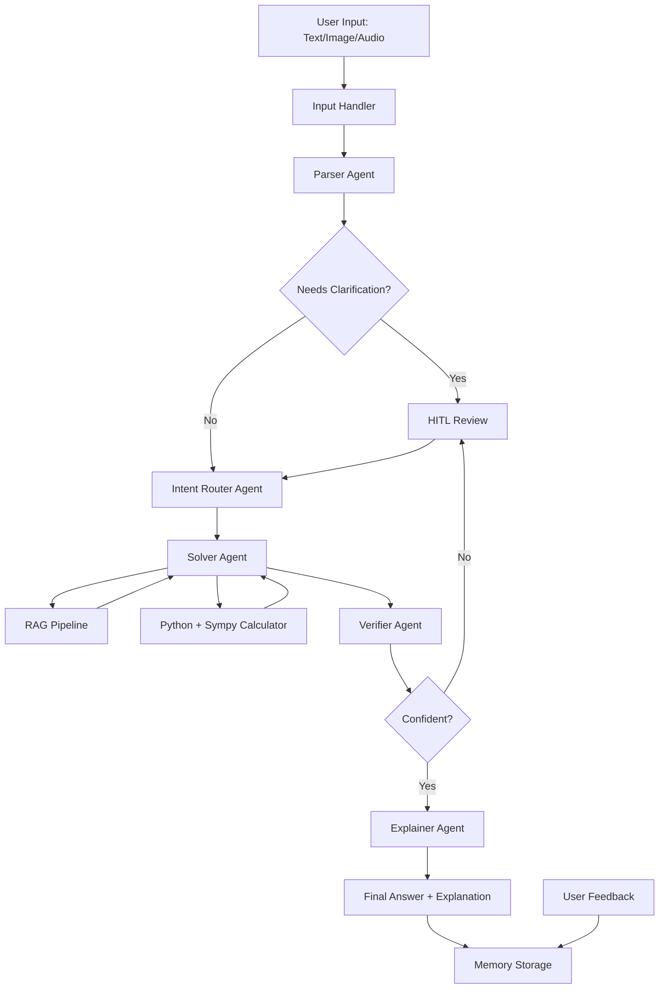

# 🧮 Math Mentor
An end-to-end AI application that solves JEE-level math problems using RAG + Multi-Agent System + Memory.

## Architecture


## Setup
1. Clone the repository
2. Create virtual environment:
```bash
   python -m venv venv
   venv\Scripts\activate
```
3. Install dependencies:
```bash
   pip install -r requirements.txt
```
4. Copy `.env.example` to `.env` and add your key:
```
   GROQ_API_KEY=your_groq_api_key_here
```
5. Build knowledge base index:
```bash
   python rag_pipeline.py
```
6. Run the app:
```bash
   streamlit run app.py
```

## Features
- Text, Image and Audio input
- 5-agent pipeline: Parser, Router, Solver, Verifier, Explainer
- RAG with FAISS vector store
- Exact math via Python + Sympy code execution
- Human-in-the-loop for low confidence answers
- Memory system with feedback learning

## Tech Stack
- LLM: Groq (LLaMA 3.3 70B)
- RAG: FAISS + sentence-transformers
- Symbolic Math: Sympy
- UI: Streamlit