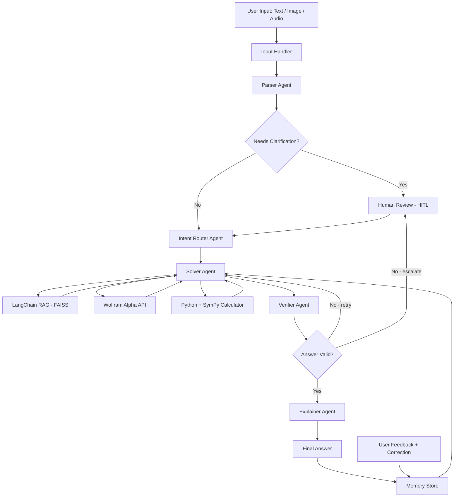

# 🧮 Math Mentor

A JEE-level math problem solver built with a 5-agent pipeline, RAG, and human-in-the-loop correction. Accepts text, image, or audio input and explains solutions step by step.

**Live Demo:** [math-mentor.streamlit.app]([https://multimodal-math-mentor-vsyl6zpvj5welkxjsvsejg.streamlit.app/](https://multimodal-math-mentor1.streamlit.app/))

---

## What it does

- Accepts a math problem as typed text, a photo of handwritten notes, or a voice recording
- Routes it through 5 agents: Parser → Intent Router → Solver → Verifier → Explainer
- Solves using Wolfram Alpha (calculus/algebra), Python+SymPy (probability/implicit differentiation), with RAG context from a curated knowledge base
- Verifies answers by substituting candidate solutions back into the original equation using SymPy
- Flags low-confidence answers for human review (HITL)
- Stores corrections from human feedback and serves them directly on similar future problems

---

## Architecture


---

## Setup

**Requirements:** Python 3.10+, free Groq API key, free Wolfram Alpha API key
```bash
git clone https://github.com/yourusername/math-mentor
cd math-mentor
python -m venv venv
venv\Scripts\activate        # Windows
# source venv/bin/activate   # Mac/Linux
pip install -r requirements.txt
```

Copy `.env.example` to `.env` and fill in your keys:
```
GROQ_API_KEY=your_groq_api_key
WOLFRAM_APP_ID=your_wolfram_app_id
```

Build the knowledge base index, then run:
```bash
python rag_pipeline.py
streamlit run app.py
```

---

## Agents

| Agent | Role |
|---|---|
| Parser | Cleans OCR/ASR output, structures the problem, flags ambiguity |
| Intent Router | Classifies topic and subtopic, selects solution strategy |
| Solver | Hybrid: Wolfram Alpha → Python+SymPy → LLM fallback |
| Verifier | Substitutes candidates back into original equation via SymPy. LLM-independent for equation problems |
| Explainer | Produces step-by-step explanation aimed at Class 11-12 level |

---

## Tech Stack

| Component | Tool |
|---|---|
| LLM | Groq - LLaMA 3.3 70B |
| Image OCR | Groq Vision - LLaMA 4 Scout |
| Audio ASR | Groq Whisper Large V3 |
| RAG Framework | LangChain + FAISS |
| Embeddings | all-MiniLM-L6-v2 (HuggingFace) |
| Symbolic Math | SymPy |
| External Computation | Wolfram Alpha API |
| Memory | FAISS + JSON |
| UI | Streamlit |

---

## Math Topics

Algebra, Probability, Calculus (limits, derivatives, integration, implicit differentiation), Linear Algebra

---

## Known Limitations

- Complex trigonometric integrals that require non-obvious algebraic simplification before integrating may not solve correctly
- Probability problem verification uses LLM re-derivation rather than symbolic checking, so confidence scores are less reliable for those problem types
- Memory correction works best when the follow-up question is phrased similarly to the original

---

## Project Structure
```
math_mentor/
├── app.py                  # Streamlit UI
├── agents.py               # All 5 agents + pipeline
├── rag_pipeline.py         # LangChain RAG setup
├── memory.py               # FAISS-based memory store
├── calculator.py           # Safe Python code executor
├── wolfram_solver.py       # Wolfram Alpha integration
├── input_handlers.py       # OCR and ASR handlers
├── knowledge_base/
│   └── math_docs.py        # Curated math knowledge base
├── data/                   # Generated indexes and memory
├── .env.example
├── requirements.txt
└── packages.txt            # System deps for deployment
```
