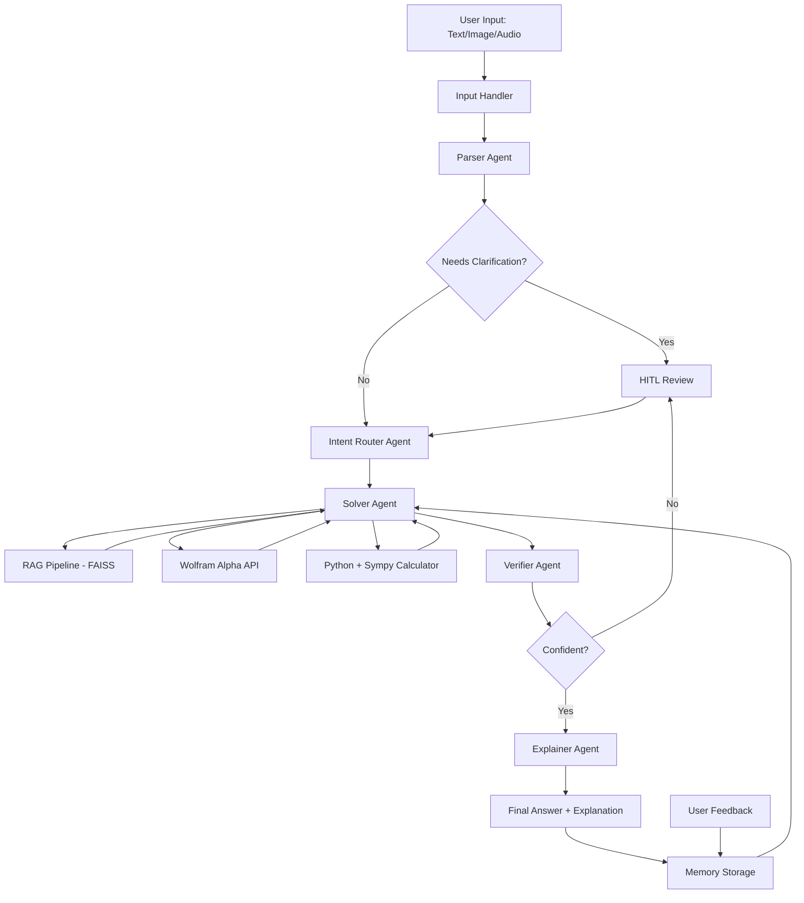

# 🧮 Math Mentor
An end-to-end AI application that solves JEE-level math problems using RAG + Multi-Agent System + Memory + Human-in-the-Loop.

## Live Demo
[(https://multimodal-math-mentor-vsyl6zpvj5welkxjsvsejg.streamlit.app/)]

## Architecture


## Setup
1. Clone the repository
2. Create virtual environment:
```bash
   python -m venv venv
   venv\Scripts\activate
```
3. Install dependencies:
```bash
   pip install -r requirements.txt
```
4. Copy `.env.example` to `.env` and add your key:
```
   GROQ_API_KEY=your_groq_api_key_here
   WOLFRAM_APP_ID=your_wolfram_app_id_here
```
5. Build knowledge base index:
```bash
   python rag_pipeline.py
```
6. Run the app:
```bash
   streamlit run app.py
```

## Features
- **Multimodal Input** — Text, Image (OCR via Groq Vision), Audio (Whisper ASR)
- **5-Agent Pipeline** — Parser, Intent Router, Solver, Verifier, Explainer
- **Hybrid Computation** — Wolfram Alpha for calculus/algebra, Python for probability, Sympy for implicit differentiation
- **RAG** — 22-document curated knowledge base with FAISS vector search
- **Human-in-the-Loop** — triggers on low confidence or ambiguous input
- **Real Memory Learning** — reuses verified correct past solutions for similar problems
- **Feedback System** — mark correct/incorrect, save corrections

## Tech Stack

| Component | Tool |
|---|---|
| LLM | Groq (LLaMA 3.3 70B) — Free |
| Image OCR | Groq Vision (LLaMA 4 Scout) |
| Audio ASR | Groq Whisper Large V3 |
| Computation | Wolfram Alpha API |
| Symbolic Math | Sympy |
| RAG | FAISS + sentence-transformers |
| Embeddings | all-MiniLM-L6-v2 |
| UI | Streamlit |
| Memory | FAISS + JSON |

## Agents
1. **Parser Agent** — Cleans OCR/ASR output, structures problem, detects ambiguity
2. **Intent Router Agent** — Classifies topic and decides solution strategy
3. **Solver Agent** — Hybrid: Wolfram Alpha + Python Calculator + Sympy
4. **Verifier Agent** — Checks correctness, domain constraints, triggers HITL if confidence < 80%
5. **Explainer Agent** — Produces student-friendly step-by-step explanation

## Math Topics Covered
- Algebra (quadratics, polynomials, sequences, complex numbers)
- Probability (classical, Bayes, hypergeometric, binomial)
- Calculus (limits, derivatives, integration, optimization, implicit differentiation)
- Linear Algebra (matrices, determinants, eigenvalues, systems of equations)